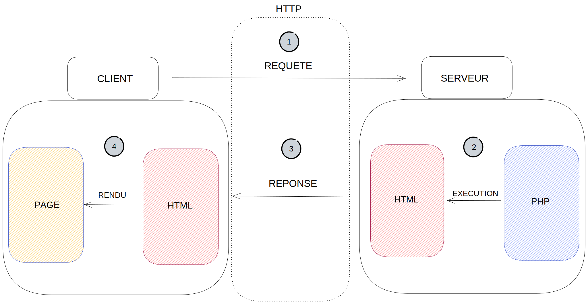

# Le PHP

## Qu'est-ce ?

Le PHP (pour _PHP Hypertext Preprocessor_) est un langage de scripts conçu pour le développement d'applications Web.
Il est exécuté "côté serveur" et renvoie toujours du texte, en cela il est tout indiqué pour travailler en tandem avec le HTML pour le rendu de pages dans un navigateur.

Pour pouvoir interpréter un fichier PHP, il faut donc un serveur web (Apache par exemple) avec un intérpréteur PHP .

Dû à sa nature de langage interprété par le serveur, le traitement est forcément différé.

Requête du navigateur au serveur -> Le serveur interprète le fichier PHP -> La réponse est renvoyée au navigateur.



1. Le client effectue une requête HTTP auprès du serveur
2. Le serveur exécute à l'aide de PHP le fichier demandé pour produire une réponse
3. La réponse au format textuel (en HTML ou autre) est envoyé en réponse HTTP
4. Le client (le navigateur) interprète le fichier HTML pour effectuer un rendu de la page et son affichage

## A quoi ça sert ?

Le PHP dû a sa nature et ses capacités permet d'effectuer des traitements spécifiques du côté du serveur d'application, ce qui lui permet par exemple de :

- Gérer les fichiers stockés sur le serveur (téléchargement ascendant/descendant)
- Se connecter à un serveur de base de données
- Effectuer des opérations en base de données
- Effectuer des traitements sensibles dont les données ne doivent pas être disponibles côté client 
- Effectuer des traitements lourds qui impliqueraient une baie de performance s'ils étaient exécutés côté client
- etc...

Mais surtout, le PHP à la base a été prévu pour pouvoir générer et renvoyer du HTML. C'est dans cette optique qu'on va l'utiliser en premier lieu.

## Utiliser le PHP

Il faut donc un interpréteur PHP et un serveur web.

Pour ça, on a installé Laragon qui nous permet d'obtenir les deux, mais on a également accès au serveur de rendu inclus dans PHPStorm pour effectuer le rendu de nos pages.
Contrairement à JS, on ne peut pas se contenter de donner notre fichier à notre navigateur, il faut que le serveur interprète le fichier PHP pour avoir accès au résultat. 

Un fichier PHP est un fichier texte, et peut contenir aussi bien du HTML que du PHP par exemple. Pour que l'interpréteur PHP puisse différencier le code à exécuter du texte à renvoyer, on englobe tout le code PHP entre deux _balises_ :

```php
<?php
//taper ici le code PHP
?>
```

### Syntaxe de base

Pour afficher quelque chose à l'écran, il faut spécifier vouloir _écrire du texte_ dans notre _résultat_. On le fait au travers de la fonction `echo` :

```php
echo "Coucou"; //affichera "Coucou" à l'écran une fois interprété
```


Une variable en PHP se déclare à l'aide des `$` :

```php
$maVariable = 12;
```
Notons que, en PHP, le `;` est obligatoire ici, et son absence ammènerait une erreur.

Les conditions se déclarent de façon classique :

```php
if (condition) {
//code
} else {
//code
}
```

Les tableaux quant à eux ont de légères différences de fonctionnement.

### Les tableaux 

Un tableau en PHP n'est pas _immutable_ comme en JS. On peut donc modifier ses informations directement en précisant son indice et en affectant une nouvelle valeur :

```php 
$voitures = ["fiat", "ferrari", "alfa romeo"];
//on accède aux cases du tableau comme d'habitude via un index
echo $voitures[1]; //affiche "ferrari" à l'écran

//contrairement à javascript, une énorme différence est que les tableaux PHP sont mutables (modifiables) en place
$voitures[0] = "lancia"; //en javascript cela aurait été interdit
echo $voitures[0]; //au lieu d'afficher "fiat" on affiche donc "lancia"
```
Ajouter une valeur peut également se faire _"à la volée"_ :

```php
//ajouter une nouvelle valeur peut se faire aussi de deux façons :
$voitures[] = "lamborghini"; //"crochet vide" serait l'équivalent d'un push : on ajoute la valeur à la fin du tableau
```

Parcourir un tableau se fait également à l'aide de _boucles_.

### La boucle For

Pour mettre en place un for, la syntaxe est sensiblement la même, mais le fonctionnement différent des variables et tableaux implique des changements dans l'écriture de notre code.

Pour parcourir un tableau par exemple : 

```php
for($i = 0; $i < count($tableau); $i++){
    echo $tableau[$i];
}
```

`count` est une des différences. On ne peut pas utiliser $tableau.length comme en javascript, pour plusieurs raisons :

1. car le `.` sert à concaténer des chaînes en PHP, pas à accéder à des méthodes d'objet
2. car les tableaux en PHP ne sont pas des objets, et n'ont pas de propriété `length` :(

On demande donc à une fonction `count` de "compter" les éléments de notre tableau et renvoyer le compte final. Ce qui revient au même.